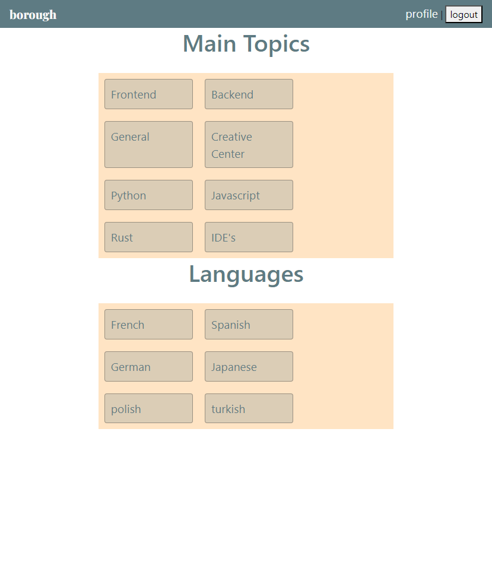

# Forum-Project

## Description
Join a community of your peers and chat about various CS topics through forum boards. Users will be able to signup for an account, browse available topics, create their own forum post, and interact with other users through the comments. 

## Installation 
To install, open your terminal and follow these instructions: 
- npm install 
- Log in to your mysql 
- source db/schema.sql
- Exit your mysql
- node seed/seed.js
- npm start
  
## Usage 

## Credits 
Made in collaboration with: 
- Kipp Cavner https://github.com/kcavner
- Danielle Leaton-Salinas https://github.com/dleatonsalinas 

The following technology has been implemented in this project: 
- Multer
